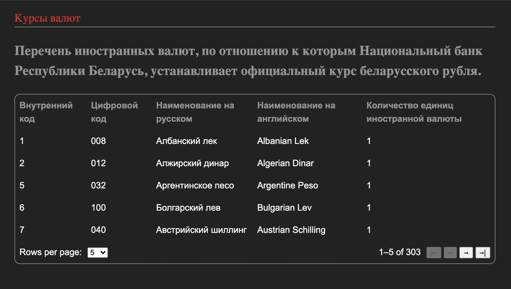
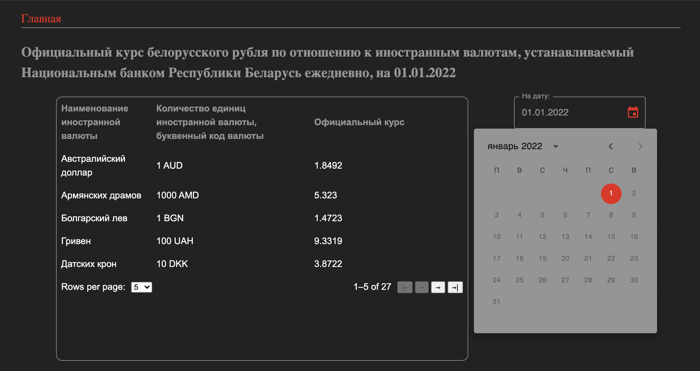
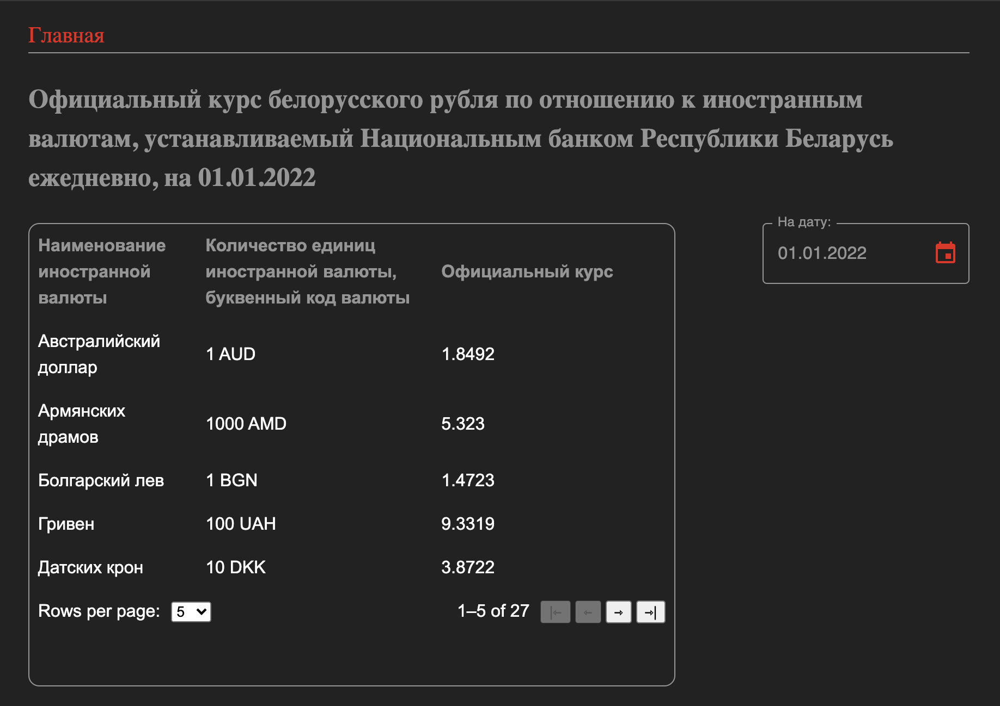

# Официальный курс беларуского рубля по отношению к иностранным валютам.

## О проекте:

Данное приложение получает актульные данные предоставляемые  Национальным банком Республики Беларусь. Курс рубля привязан к дате в календаре приложения, но по умолчанию мы всегда получаем курс относительно актульной даты. Так же в основной таблице на главной странице подтягиваются другие данные, такие как перечень иностранных валют по отношению к которым НБРБ устанавливает официальный курс беларуского рубля, внутрений код валюты и тд.

### Для разработки приложения я использовал следующие инструменты:

*[React.js](https://reactjs.org/)

*[Redux](https://redux.js.org/)

*[React-router-dom](https://v5.reactrouter.com/)

*[Axios.js](https://axios-http.com/)

*[Material-UI](https://mui.com/)

*[Date-fns](https://date-fns.org/)

Для того что бы развернуть приложение на хостинге Git Hub я использовал дополнительный пакет gh-pages.

При разработке данного проекта я потренировался делать запросы и отображать нужные для приложения данные, а так же обробатывать ошибки. В том числе прилошлось разбираться с документацией некоторых из выше описанных инструментов тк с ними я работал впервые. 

В тeкущей ветке вы можете ознакомиться с кодом а [здесь](https://sergey-shar.github.io/alfa_bank_test/) вы можете увидеть развернутое на хостинге приложение. 

